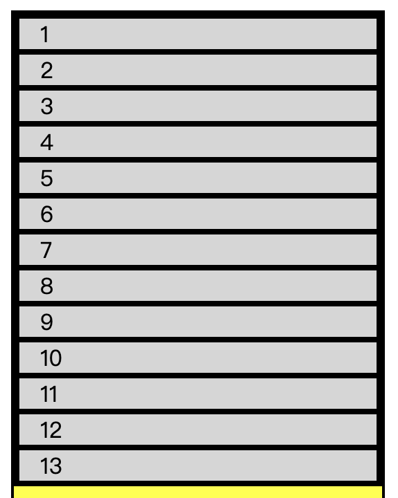
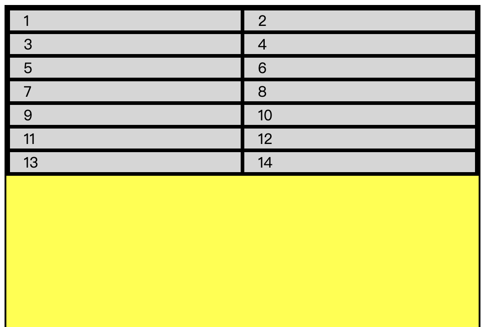
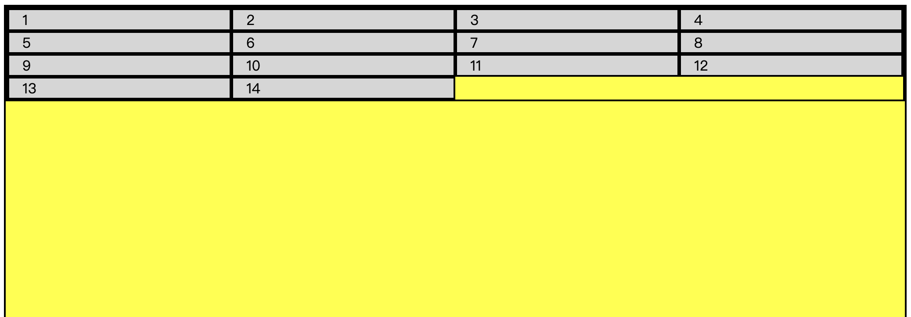

# myGrid

## 自实简易现栅格系统

## 可选版本

### CSS

#### 基于 float 的原生 CSS 版本

完成 ✅

`./css/grid-float.css`

#### 基于 flex 的原生 CSS 版本

完成 ✅

`./css/grid-flex.css`

### SCSS

可以通过调整 `./scss/grid-flex-scss/_variables.scss` 文件来进行个性化调整。

#### 基于 float 的 SCSS 版本

未完成 ❌

`./scss/grid-float-scss/`

#### 基于 flex 的 SCSS 版本

完成 ✅

`./scss/grid-flex-scss/`